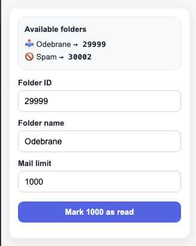

# Onet Mail - Mark Read

Chrome extension for marking multiple emails as read in Onet Mail.



## Features

- Mark emails as read in:
  - Inbox
  - Spam
- Custom limit support
- Works directly in the browser using your current Onet session
- Simple popup UI

---

## Requirements

- Google Chrome or any Chromium-based browser
- Logged in to Onet Mail

---

## Installation

### 1. Clone repository

```bash
git clone https://github.com/g0at1/onet-poczta-mark-emails.git
```

### 2. Open Chrome extensions page

```text
chrome://extensions
```

### 3. Enable Developer Mode

Turn on:

```text
Developer mode
```

### 4. Load extension

Click:

```text
Load unpacked
```

Then select the project folder.

---

## Usage

1. Open Onet Mail:

```text
https://poczta.onet.pl
```

2. Click the extension icon

3. Configure:
   - Folder ID
   - Folder name
   - Limit

4. Click:

```text
Mark as read
```

---

## Permissions

The extension uses:

- `activeTab`
- `scripting`

Host permissions:

- `https://poczta.onet.pl/*`
- `https://api.poczta.onet.pl/*`

These permissions are required to:
- access the currently opened Onet Mail tab
- execute the script
- communicate with the Onet Mail API

---

## How it works

The extension:
1. Fetches email IDs from the selected folder
2. Sends a PATCH request to the Onet Mail API
3. Marks fetched emails as read using the `\Seen` flag

The extension works entirely locally in your browser and uses your existing authenticated Onet session.

---

## Disclaimer

This project is unofficial and is not affiliated with Onet.

Use at your own risk.

---
